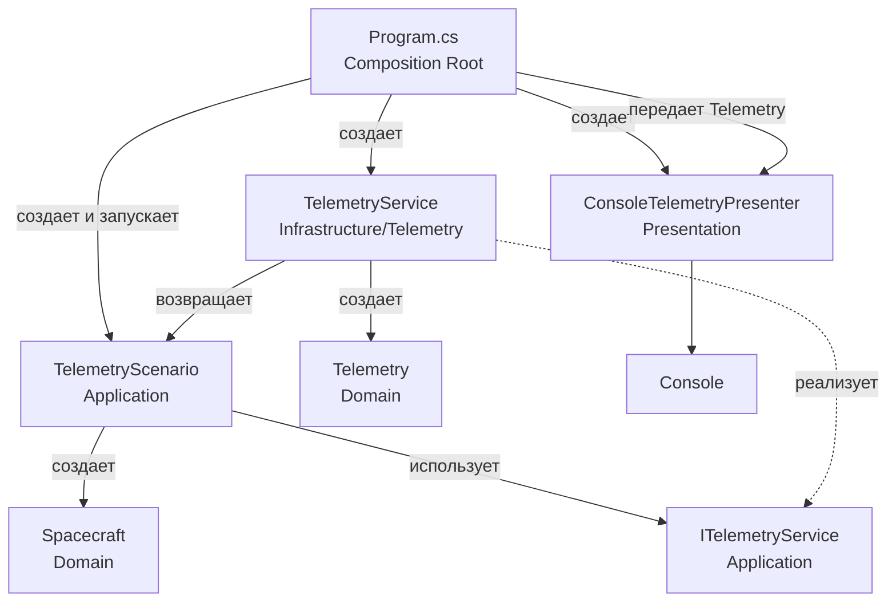

# Архитектура решения 01-task-async-await

## Текущее дерево

```text
01-task-async-await/
├── 01-task-async-await.csproj
├── Program.cs
├── 0601_notes.txt
├── 0601AI_notesExplaining.md
├── Application/
│   └── Telemetry/
│       ├── ITelemetryService.cs
│       └── TelemetryScenario.cs
├── Domain/
│   ├── Spacecraft.cs
│   └── Telemetry.cs
├── Infrastructure/
│   └── Telemetry/
│       └── TelemetryService.cs
└── Presentation/
    └── ConsoleTelemetryPresenter.cs
```

## Роли

### Domain

`Spacecraft` описывает космический корабль и проверяет корректность `Id` и `Name`.

`Telemetry` хранит результат измерения:

```csharp
public sealed record Telemetry(
    int SpacecraftId,
    double Temperature,
    double BatteryPercent);
```

Domain не знает о консоли, файлах или базе данных.

### Application

`ITelemetryService` задает контракт получения телеметрии.

`TelemetryScenario` содержит сценарий использования:

1. Создает один `Spacecraft`.
2. Один раз вызывает `ReceiveTelemetryAsync`.
3. Возвращает полученный `Telemetry`.

```csharp
public async Task<Telemetry> RunAsync()
{
    var spacecraft = new Spacecraft(1, "Aurora");
    return await telemetryService.ReceiveTelemetryAsync(spacecraft);
}
```

Application не знает, как результат будет показан пользователю.

### Infrastructure

`Infrastructure/Telemetry/TelemetryService.cs` реализует `ITelemetryService`.

`ReceiveTelemetryAsync` проверяет корабль, имитирует асинхронную работу, рассчитывает температуру и заряд батареи, затем возвращает `Telemetry`.

### Presentation

`ConsoleTelemetryPresenter` получает `Telemetry` и выводит `Temperature` и `BatteryPercent` в консоль.

## Точка входа

`Program.cs` является composition root. Он соединяет конкретные реализации и запускает сценарий:

```csharp
var telemetryService = new TelemetryService();
var telemetryScenario = new TelemetryScenario(telemetryService);
var telemetry = await telemetryScenario.RunAsync();

new ConsoleTelemetryPresenter().Show(telemetry);
```

В `Program.cs` нет бизнес-логики. Он только создает объекты, передает зависимости и запускает выполнение.

## Pipeline

```text
Program.cs
    |
    | создает TelemetryService
    | создает TelemetryScenario
    v
TelemetryScenario.RunAsync()
    |
    | создает Spacecraft
    | вызывает ITelemetryService.ReceiveTelemetryAsync()
    v
Infrastructure.TelemetryService
    |
    | Task.Delay()
    | рассчитывает Temperature и BatteryPercent
    | создает Telemetry
    v
Telemetry возвращается в Program.cs
    |
    | ConsoleTelemetryPresenter.Show(telemetry)
    v
Вывод результата в консоль
```



## Направление зависимостей

```text
                                 Program
                             /    |    \
                            v     v     v
        Application Infrastructure Presentation
                 |          |          |
                 v          |          v
             Domain <------+-------- Domain

Infrastructure ---> Application
```

`Program` является composition root и зависит от конкретных реализаций из `Application`, `Infrastructure` и `Presentation`. `Application` и `Infrastructure` используют модели `Domain`, а `Infrastructure` реализует контракт, объявленный в `Application`.

В этой учебной структуре `Domain` показан с обеих сторон диаграммы только для наглядности: фактически это один и тот же слой с моделями `Spacecraft` и `Telemetry`.

Чтобы изменить способ вывода, достаточно заменить `ConsoleTelemetryPresenter` в `Program.cs`. `TelemetryScenario` при этом менять не нужно.

## Вывод программы

```text
Temperature: 17,5
Battery: 93%
```
