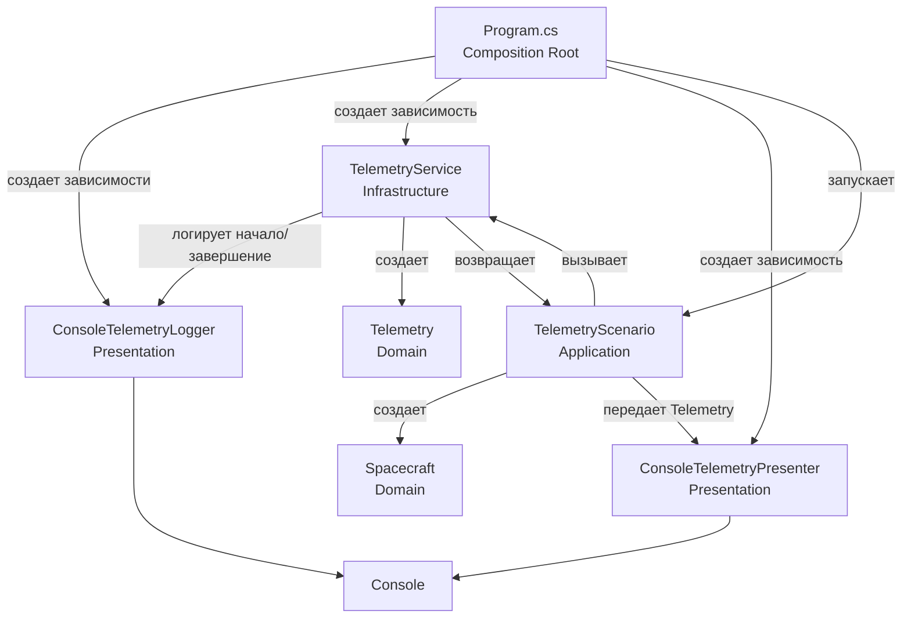

# Архитектура решения 01-task-async-await

## Текущее дерево

```text
06-async-concurrency/
├── Week06.slnx
└── 01-task-async-await/
    ├── 01-task-async-await.csproj
    ├── Program.cs
    ├── 0601_notes.txt
    ├── 0601AI_notesExplaining.md
    │
    ├── Application/
    │   └── Telemetry/
    │       ├── ITelemetryLogger.cs
    │       ├── ITelemetryPresenter.cs
    │       ├── ITelemetryService.cs
    │       └── TelemetryScenario.cs
    │
    ├── Domain/
    │   ├── Spacecraft.cs
    │   └── Telemetry.cs
    │
    ├── Infrastructure/
    │   └── TelemetryService.cs
    │
    └── Presentation/
        ├── ConsoleTelemetryLogger.cs
        └── ConsoleTelemetryPresenter.cs
```

`Week06.slnx` группирует проекты. Сейчас в нем находится один проект: `01-task-async-await`.

Папки `Application`, `Domain`, `Infrastructure` и `Presentation` являются логическими слоями внутри одного `.csproj`. Это пока не отдельные физические проекты.

## Роли слоев

### Domain

Содержит основные данные и правила предметной области.

`Spacecraft` описывает космический корабль:

```csharp
public sealed class Spacecraft
{
    public int Id { get; }
    public string Name { get; }
}
```

Конструктор проверяет, что `Id` больше нуля, а имя не пустое.

`Telemetry` описывает результат измерения:

```csharp
public sealed record Telemetry(
    int SpacecraftId,
    double Temperature,
    double BatteryPercent);
```

Domain не знает о консоли, файлах, базе данных или HTTP.

### Application

Содержит сценарии использования и интерфейсы, необходимые этим сценариям.

`TelemetryScenario` выполняет сценарий:

1. Создает один `Spacecraft`.
2. Один раз вызывает `ReceiveTelemetryAsync`.
3. Передает результат presenter-у.

```csharp
var spacecraft = new Spacecraft(1, "Aurora");

Telemetry telemetry =
    await telemetryService.ReceiveTelemetryAsync(spacecraft);

presenter.Show(telemetry);
```

Интерфейсы Application:

- `ITelemetryService` описывает получение телеметрии.
- `ITelemetryLogger` описывает логирование начала и завершения.
- `ITelemetryPresenter` описывает отображение результата.

Application работает с абстракциями и не знает, используется ли консоль, файл, web-интерфейс или тестовый объект.

### Infrastructure

Содержит техническую реализацию получения данных.

`TelemetryService` реализует `ITelemetryService`. Метод `ReceiveTelemetryAsync`:

1. Проверяет `Spacecraft`.
2. Сообщает логгеру о начале.
3. Имитирует асинхронную работу через `Task.Delay`.
4. Рассчитывает температуру и заряд батареи.
5. Создает `Telemetry`.
6. Сообщает логгеру о завершении.
7. Возвращает результат.

### Presentation

Содержит конкретные способы взаимодействия с пользователем.

- `ConsoleTelemetryLogger` реализует `ITelemetryLogger` и пишет сообщения о начале и завершении в консоль.
- `ConsoleTelemetryPresenter` реализует `ITelemetryPresenter` и выводит значения температуры и заряда батареи.

## Точка входа

`Program.cs` является composition root: местом, где конкретные реализации соединяются с интерфейсами.

```csharp
var telemetryLogger = new ConsoleTelemetryLogger();
var telemetryService = new TelemetryService(telemetryLogger);
var telemetryScenario = new TelemetryScenario(
    telemetryService,
    new ConsoleTelemetryPresenter());

await telemetryScenario.RunAsync();
```

`Program.cs` не содержит бизнес-логику. Он только создает зависимости, передает их конструкторам и запускает сценарий.

## Pipeline выполнения

```text
Program.cs
    |
    | создает ConsoleTelemetryLogger
    |
    | создает TelemetryService
    |
    | создает ConsoleTelemetryPresenter
    |
    | создает TelemetryScenario
    v
RunAsync()
    |
    | создает Spacecraft
    v
TelemetryService.ReceiveTelemetryAsync()
    |
    | ConsoleTelemetryLogger.Started()
    |
    | Task.Delay()
    |
    | создается Telemetry
    |
    | ConsoleTelemetryLogger.Completed()
    v
Telemetry возвращается в TelemetryScenario
    |
    | presenter.Show(telemetry)
    v
Вывод Temperature и BatteryPercent
```

### Mermaid-диаграмма



## Направление зависимостей

Логическая схема:

```text
Presentation ------┐
Infrastructure ----+----> Application ----> Domain
Program -----------┘
```

Конкретные зависимости:

```text
TelemetryScenario
    зависит от:
    - ITelemetryService
    - ITelemetryPresenter

TelemetryService
    реализует:
    - ITelemetryService
    зависит от:
    - ITelemetryLogger

ConsoleTelemetryPresenter
    реализует:
    - ITelemetryPresenter

ConsoleTelemetryLogger
    реализует:
    - ITelemetryLogger
```

Главный принцип:

> Application определяет, что ему нужно, а Infrastructure и Presentation предоставляют конкретную реализацию.

Например, вместо `ConsoleTelemetryPresenter` можно будет передать `JsonTelemetryPresenter`, `FileTelemetryPresenter` или `TestTelemetryPresenter`. Сам `TelemetryScenario` менять не придется.

## Вывод программы

```text
Начало получения телеметрии от Aurora
Завершение получения телеметрии от Aurora
Temperature: 17,5
Battery: 93%
```
