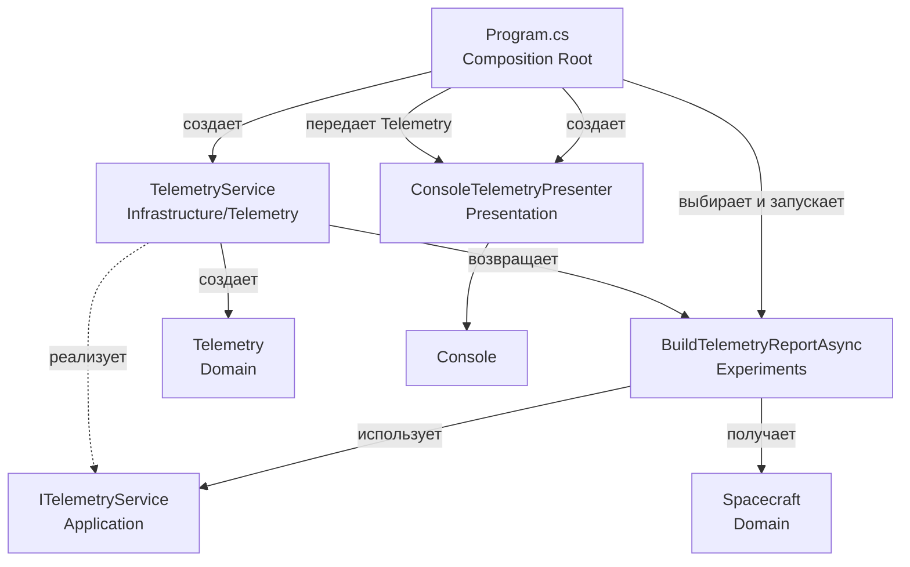

# Архитектура решения 01-task-async-await

## Текущее дерево

```text
01-task-async-await/
├── 01-task-async-await.csproj
├── Program.cs
├── 0601_notes.txt
├── 0601AI_notesExplaining.md
├── Application/
│   └── Telemetry/
│       ├── ITelemetryService.cs
│       └── TelemetryScenario.cs
├── Experiments/
│   ├── BlockingVsAsyncExperiment.cs
│   ├── BuildTelemetryReportAsync.cs
│   ├── RegularAwaitExperiment.cs
│   ├── SequentialAwaitExperiment.cs
│   ├── StartThenAwaitExperiment.cs
│   ├── TaskFromResultExperiment.cs
│   └── TaskStateExperiment.cs
├── Domain/
│   ├── Spacecraft.cs
│   └── Telemetry.cs
├── Infrastructure/
│   └── Telemetry/
│       └── TelemetryService.cs
└── Presentation/
    └── ConsoleTelemetryPresenter.cs
```

## Роли

### Domain

`Spacecraft` описывает космический корабль и проверяет корректность `Id` и `Name`.

`Telemetry` хранит результат измерения:

```csharp
public sealed record Telemetry(
    int SpacecraftId,
    double Temperature,
    double BatteryPercent);
```

Domain не знает о консоли, файлах или базе данных.

### Application

`ITelemetryService` задает контракт получения телеметрии.

`TelemetryScenario` содержит сценарий использования:

1. Создает один `Spacecraft`.
2. Один раз вызывает `ReceiveTelemetryAsync`.
3. Возвращает полученный `Telemetry`.

```csharp
public async Task<Telemetry> RunAsync()
{
    var spacecraft = new Spacecraft(1, "Aurora");
    return await telemetryService.ReceiveTelemetryAsync(spacecraft);
}
```

Application не знает, как результат будет показан пользователю.

Папка `Experiments` содержит небольшие изолированные сценарии для изучения
разных вариантов работы с `Task` и `await`. `Program.cs` предоставляет для них
методы-обертки `Run...ExperimentAsync`, а в `Main` выбирается нужный сценарий.

### Infrastructure

`Infrastructure/Telemetry/TelemetryService.cs` реализует `ITelemetryService`.

`ReceiveTelemetryAsync` проверяет корабль, имитирует асинхронную работу, рассчитывает температуру и заряд батареи, затем возвращает `Telemetry`.

### Presentation

`ConsoleTelemetryPresenter` получает `Telemetry` и выводит `Temperature` и `BatteryPercent` в консоль.

Для эксперимента `BuildTelemetryReportAsync` presenter также принимает
`Task<string>`, ожидает его и выводит готовый строковый отчёт через `GetAndShow`.

## Точка входа

`Program.cs` является composition root. Он создает сервис и космический корабль,
запускает выбранный эксперимент, выводит телеметрию и измеряет общее время:

```csharp
var stopwatch = Stopwatch.StartNew();
var telemetryService = new TelemetryService();
var spacecraft = new Spacecraft(1, "Apollo 11");

Telemetry telemetry = await RunBuildTelemetryReportAsync(
    telemetryService,
    spacecraft);
new ConsoleTelemetryPresenter().Show(telemetry);

stopwatch.Stop();
Console.WriteLine($"Total execution time: {stopwatch.ElapsedMilliseconds} ms");
```

Чтобы переключить эксперимент, достаточно заменить вызов `RunBuildTelemetryReportAsync`
на другой метод-обертку, например `RunRegularAwaitExperimentAsync` или
`RunTaskFromResultExperimentAsync`.

## Pipeline

```text
Program.cs
    |
    | создает TelemetryService
    | создает Spacecraft (Apollo 11)
    v
RunBuildTelemetryReportAsync()
    |
    | вызывает BuildTelemetryReportAsync.RunAsync()
    v
BuildTelemetryReportAsync
    |
    | получает Task<Telemetry>
    | await преобразует его в Telemetry
    | формирует string report
    | возвращает Task<string>
    |
    v
Infrastructure.TelemetryService
    |
    | Task.Delay()
    | рассчитывает Temperature и BatteryPercent
    | создает Telemetry
    v
Task<string> возвращается в Program.cs
    |
    | ConsoleTelemetryPresenter.GetAndShow(finalTask)
    v
Вывод результата в консоль
```



## Направление зависимостей

```text
                                 Program
                             /    |    \
                            v     v     v
        Application Infrastructure Presentation
                 |          |          |
                 v          |          v
             Domain <------+-------- Domain

Infrastructure ---> Application
```

`Program` является composition root и зависит от конкретных реализаций из `Application`, `Infrastructure` и `Presentation`. `Application` и `Infrastructure` используют модели `Domain`, а `Infrastructure` реализует контракт, объявленный в `Application`.

В этой учебной структуре `Domain` показан с обеих сторон диаграммы только для наглядности: фактически это один и тот же слой с моделями `Spacecraft` и `Telemetry`.

Чтобы изменить учебный сценарий, достаточно заменить вызов одного из методов
`Run...ExperimentAsync` в `Program.cs`. Сам `TelemetryService` при этом менять
не нужно.

## Вывод программы

```text
Task status: WaitingForActivation
Result: Spacecraft 1: temperature 17,5, battery 93%
Total execution time: около 1000 ms
```

## Дерево решений для `Task` и `await`

```text
Нужно получить результат асинхронной операции?
├── Нет, результат уже известен прямо сейчас
│   └── Вернуть Task.FromResult(value)
│       Пример: TaskFromResultExperiment
│       Task сразу имеет состояние RanToCompletion.
│
└── Да, операция выполняется не сразу
    ├── Результат нужен сразу после запуска?
    │   └── Да: await service.ReceiveTelemetryAsync(spacecraft)
    │       Пример: RegularAwaitExperiment
    │
    └── Между запуском и ожиданием есть другая работа?
        ├── Нет
        │   └── Обычный await достаточен.
        │
        └── Да
            ├── Нужно выполнить обычную работу до получения результата?
            │   └── Сначала сохранить Task, выполнить работу, затем await.
            │       Пример: StartThenAwaitExperiment
            │
            └── Нужно выполнить несколько операций?
                ├── Они независимы?
                │   └── Запустить несколько Task, затем await результаты.
                │
                └── Они должны идти одна за другой?
                    └── Запускать следующую операцию после await предыдущей.
                        Пример: SequentialAwaitExperiment
```

### Диагностика состояния

Если нужно понять, что происходит с операцией, проверить `Task.Status` и
`Task.IsCompleted` до и после `await`.

Пример: `TaskStateExperiment`.

### Чего избегать

`.Result` и `.Wait()` блокируют текущий поток. Для асинхронного кода следует
использовать `await`, как показывает `RegularAwaitExperiment`. Сравнение
блокирующего и асинхронного поведения находится в `BlockingVsAsyncExperiment`.
